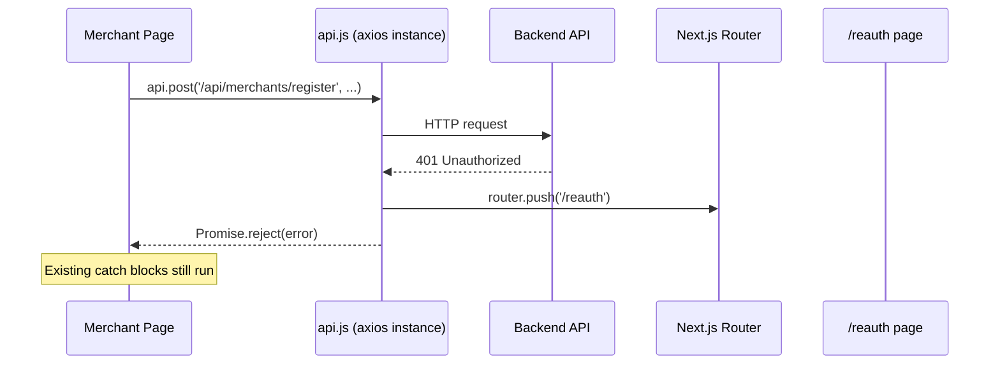
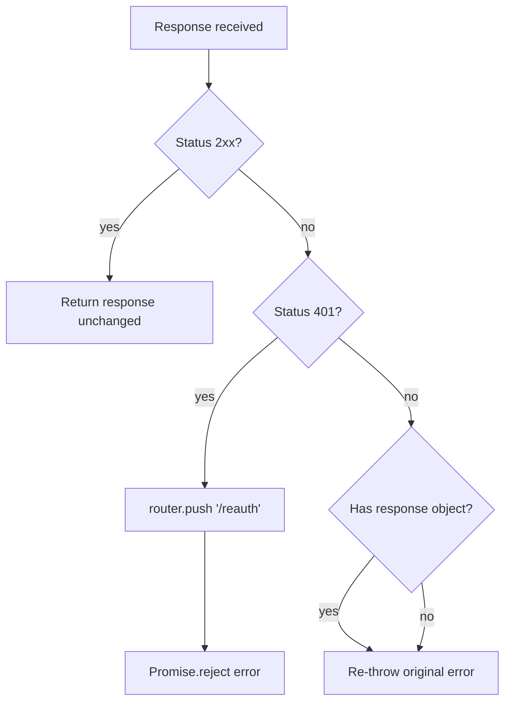

# Design Document: API 401 Interceptor

## Overview

This feature adds a response interceptor to the central axios instance in `novaRewards/frontend/lib/api.js`. When any API call returns HTTP 401 (Unauthorized), the interceptor automatically redirects the merchant to a `/reauth` page, giving them a clear recovery path. All other responses — successes and non-401 errors — pass through unchanged so existing error handling is unaffected.

The interceptor is registered once at module initialisation time. Because ES modules are singletons in Node/Next.js, the module body runs exactly once per application session, making idempotency a natural consequence of the module system rather than something that needs runtime guards.

## Architecture





## Components and Interfaces

### 1. `novaRewards/frontend/lib/api.js` (modified)

The axios instance gains a single response interceptor. The interceptor needs access to the Next.js router, but `next/router` can only be used inside React components or after the router is initialised. The standard pattern for using the router outside React is to import `Router` directly from `next/router` (the singleton) and call `Router.push(...)`.

```js
import axios from 'axios';
import Router from 'next/router';

const api = axios.create({
  baseURL: process.env.NEXT_PUBLIC_API_URL || 'http://localhost:3001',
  headers: { 'Content-Type': 'application/json' },
});

api.interceptors.response.use(
  (response) => response,                          // 2xx: pass through
  (error) => {
    if (error.response?.status === 401) {
      Router.push('/reauth');
    }
    return Promise.reject(error);                  // always reject
  }
);

export default api;
```

Key design decisions:
- `Router` (capital R) from `next/router` is the singleton router, usable outside components.
- `Promise.reject(error)` is returned unconditionally — the redirect and the rejection are not mutually exclusive.
- No runtime guard is needed for idempotency; the module body runs once.

### 2. `novaRewards/frontend/pages/reauth.js` (new)

A minimal static page. It requires no props, no API calls, and no authenticated state.

```
/reauth
  - Heading: "Session Expired"
  - Body: explanation that the API key is invalid or expired
  - Link: "Return to Merchant Portal" → /merchant
```

## Data Models

No new data models are introduced. The interceptor operates on the existing axios response/error objects:

```
AxiosResponse { status, data, headers, config, request }
AxiosError    { message, response?: AxiosResponse, request, config }
```

The interceptor reads `error.response?.status` (optional chaining handles network errors where `response` is undefined).

## Correctness Properties

*A property is a characteristic or behavior that should hold true across all valid executions of a system — essentially, a formal statement about what the system should do. Properties serve as the bridge between human-readable specifications and machine-verifiable correctness guarantees.*

### Property 1: 2xx responses pass through unchanged

*For any* axios response with a status code in the range 200–299, the interceptor's success handler should return the exact same response object it received, without modification.

**Validates: Requirements 1.2**

### Property 2: 401 errors trigger a redirect

*For any* axios error whose `response.status` is 401, the interceptor's error handler should call `Router.push` with the argument `'/reauth'`.

**Validates: Requirements 1.3**

### Property 3: Non-401 errors are re-thrown unchanged

*For any* axios error whose `response.status` is a value other than 401 (e.g. 400, 403, 404, 500), the interceptor should re-throw the original error object — the same reference, unmodified — and should not call `Router.push`.

**Validates: Requirements 1.4, 4.1**

### Property 4: 401 handling always rejects the promise

*For any* axios error whose `response.status` is 401, the interceptor should return a rejected promise (i.e. `Promise.reject`) regardless of whether the redirect was triggered, so that awaiting callers receive a rejection rather than hanging.

**Validates: Requirements 4.3**

## Error Handling

| Scenario | Interceptor behaviour |
|---|---|
| 2xx response | Pass through to caller unchanged |
| 401 response | `Router.push('/reauth')` then `Promise.reject(error)` |
| Non-401 error response (4xx/5xx) | `Promise.reject(error)` — original error, no modification |
| Network error (no `response`) | `Promise.reject(error)` — `error.response` is undefined, 401 check is false via optional chaining |

The optional chaining `error.response?.status` is the single guard that handles both network errors and HTTP errors uniformly without branching.

## Testing Strategy

### Unit tests (Jest + React Testing Library)

Unit tests cover specific examples and edge cases:

- **Example A — Single interceptor registration**: After importing `api.js`, assert that `api.interceptors.response.handlers` has exactly one entry. This covers Requirements 1.1, 3.1, 3.2.
- **Example B — Network error passthrough**: Create an `AxiosError` with no `response` property, pass it to the error handler, assert `Router.push` was not called and the promise rejects. Covers Requirement 4.2.
- **Example C — Reauth page renders correctly**: Render `<ReauthPage />` with no props, assert the explanatory message is present and a link to `/merchant` exists. Covers Requirements 2.1, 2.2, 2.3.

### Property-based tests (fast-check)

fast-check is the recommended PBT library for JavaScript/TypeScript. Install with:

```
npm install --save-dev fast-check
```

Each property test runs a minimum of 100 iterations. Tests are tagged with a comment referencing the design property.

**Property 1 test** — `Feature: api-401-interceptor, Property 1: 2xx responses pass through unchanged`
Generate random integers in [200, 299] and random response body objects. Construct a mock `AxiosResponse` and pass it through the success handler. Assert the returned value is the same reference.

**Property 2 test** — `Feature: api-401-interceptor, Property 2: 401 errors trigger a redirect`
Generate random `AxiosError` objects with `response.status = 401` and varying bodies/headers. Pass each to the error handler. Assert `Router.push` was called with `'/reauth'` for every generated input.

**Property 3 test** — `Feature: api-401-interceptor, Property 3: Non-401 errors are re-thrown unchanged`
Generate random HTTP error status codes excluding 401 (e.g. from the set {400, 402–599}). Construct mock `AxiosError` objects. Pass each to the error handler. Assert the rejected value is the same object reference and `Router.push` was not called.

**Property 4 test** — `Feature: api-401-interceptor, Property 4: 401 handling always rejects the promise`
Generate random `AxiosError` objects with `response.status = 401`. Pass each to the error handler. Assert the return value is a rejected promise (check with `await expect(...).rejects`).

### Test configuration

```js
// jest.config.js addition for frontend
testEnvironment: 'jsdom'
```

Mock `next/router` in tests:
```js
jest.mock('next/router', () => ({ push: jest.fn() }));
```
