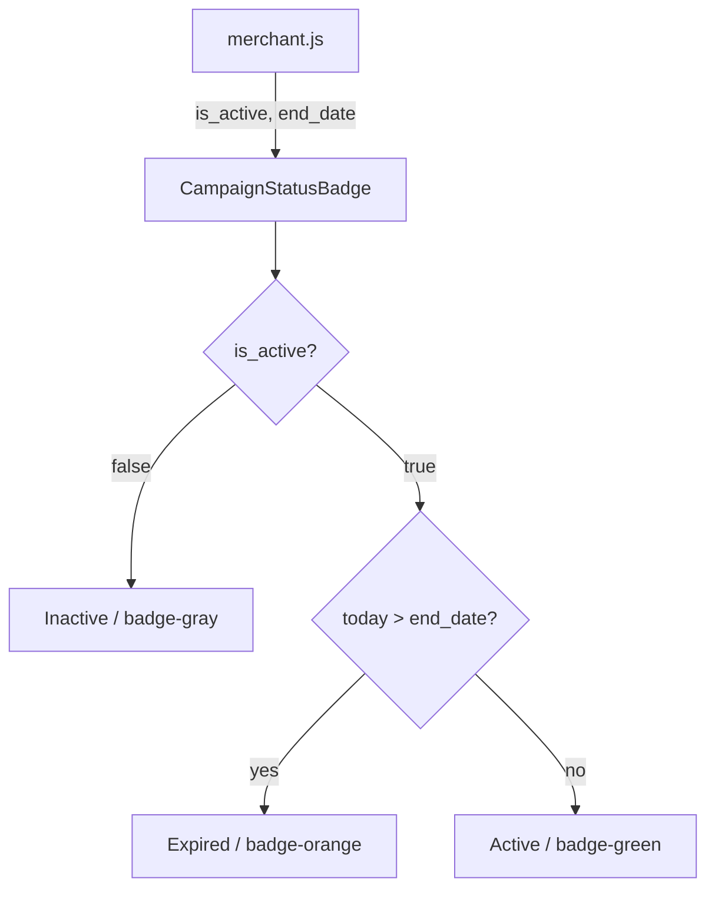

# Design Document: campaign-status-badge

## Overview

The campaign-status-badge feature introduces a `CampaignStatusBadge` React component that derives and renders a colour-coded, accessible pill badge for each campaign row in the merchant portal. Status is computed purely on the client from two existing API fields — `is_active` (boolean) and `end_date` (ISO date string) — so no backend changes are required.

The three possible states are:

| Status   | Condition                                          | CSS class     |
|----------|----------------------------------------------------|---------------|
| Active   | `is_active === true` AND today ≤ `end_date`        | `badge-green` |
| Expired  | `is_active === true` AND today > `end_date`        | `badge-orange`|
| Inactive | `is_active === false` (regardless of `end_date`)   | `badge-gray`  |

The `Inactive` check takes priority: if `is_active` is `false`, the badge always shows "Inactive" regardless of the date.

---

## Architecture

This is a purely frontend change within the existing Next.js app. No new pages, API routes, or data-fetching logic are introduced.

```
novaRewards/frontend/
├── components/
│   └── CampaignStatusBadge.js   ← new component
├── pages/
│   └── merchant.js              ← updated: import + use CampaignStatusBadge
└── styles/
    └── globals.css              ← updated: add --badge-orange-* tokens + .badge-orange rule
```

The status derivation logic lives entirely inside `CampaignStatusBadge`. The merchant page becomes a thin consumer that passes props down.



---

## Components and Interfaces

### CampaignStatusBadge

**File:** `novaRewards/frontend/components/CampaignStatusBadge.js`

**Props:**

| Prop        | Type    | Required | Description                                      |
|-------------|---------|----------|--------------------------------------------------|
| `is_active` | boolean | yes      | Whether the campaign has been manually activated |
| `end_date`  | string  | yes      | ISO 8601 date string (e.g. `"2025-12-31"`)       |

**Behaviour:**
1. If `is_active` is falsy → status = `"Inactive"`, class = `badge-gray`
2. Else if `new Date(end_date) < new Date()` (today's local date) → status = `"Expired"`, class = `badge-orange`
3. Else → status = `"Active"`, class = `badge-green`

**Rendered output:**
```jsx
<span className={`badge ${colorClass}`} aria-label={status}>
  {status}
</span>
```

The `aria-label` mirrors the visible text so screen readers announce the same value regardless of colour.

### merchant.js (updated)

The existing inline badge logic in the campaign table is replaced with `<CampaignStatusBadge is_active={c.is_active} end_date={c.end_date} />`. The `expired` local variable and the inline `className` ternary are removed.

---

## Data Models

No new data models are introduced. The component consumes fields already present in the campaign object returned by `GET /api/campaigns/:merchantId`:

```js
{
  id: number,
  name: string,
  reward_rate: string,
  start_date: string,   // ISO date
  end_date: string,     // ISO date  ← used for expiry check
  is_active: boolean    // ← used for active/inactive check
}
```

The status derivation is a pure function of these two fields and the client's current date (`new Date()`).

---

## Correctness Properties

*A property is a characteristic or behavior that should hold true across all valid executions of a system — essentially, a formal statement about what the system should do. Properties serve as the bridge between human-readable specifications and machine-verifiable correctness guarantees.*


### Property 1: Active status derivation and styling

*For any* `is_active = true` and `end_date` that is today or in the future, the `CampaignStatusBadge` component should render the text label `"Active"` and apply the CSS class `badge-green`.

**Validates: Requirements 1.1, 2.1**

### Property 2: Expired status derivation and styling

*For any* `is_active = true` and `end_date` that is strictly in the past, the `CampaignStatusBadge` component should render the text label `"Expired"` and apply the CSS class `badge-orange`.

**Validates: Requirements 1.2, 2.2**

### Property 3: Inactive overrides end_date

*For any* `end_date` value (past, present, or future), when `is_active = false`, the `CampaignStatusBadge` component should render the text label `"Inactive"` and apply the CSS class `badge-gray`.

**Validates: Requirements 1.3, 2.3**

### Property 4: aria-label matches visible text

*For any* combination of `is_active` and `end_date`, the `aria-label` attribute on the rendered badge element should equal the visible text content of that element.

**Validates: Requirements 4.1, 4.2**

### Property 5: Badge count equals campaign count

*For any* non-empty list of campaigns rendered in the merchant portal table, the number of badge elements rendered should equal the number of campaigns in the list.

**Validates: Requirements 3.1**

---

## Error Handling

The component is a pure rendering function with no async operations or network calls, so the error surface is minimal:

- **Missing `end_date`**: If `end_date` is `null`, `undefined`, or an unparseable string, `new Date(end_date)` returns `Invalid Date`. Comparisons with `Invalid Date` always return `false`, so the branch `today > end_date` evaluates to `false`, and the badge falls through to `"Active"` (when `is_active` is true). To avoid this ambiguity, the component should treat an invalid or missing `end_date` as already expired when `is_active` is true. A guard `isNaN(new Date(end_date))` handles this.
- **Missing `is_active`**: A falsy value (including `undefined`) is treated as `false`, so the badge shows `"Inactive"`. This is a safe default.
- **No error boundary needed**: The component renders a single `<span>` and cannot throw under normal conditions.

---

## Testing Strategy

The project uses **Jest** with **@testing-library/react** (evidenced by `__tests__/TransactionLink.test.js`). For property-based testing, **fast-check** is the recommended library for JavaScript/TypeScript projects — it integrates directly with Jest and requires no additional test runner.

### Unit Tests (specific examples and edge cases)

Implemented in `novaRewards/frontend/__tests__/CampaignStatusBadge.test.js`:

- Renders "Active" / `badge-green` for a future end_date with `is_active=true`
- Renders "Expired" / `badge-orange` for a past end_date with `is_active=true`
- Renders "Inactive" / `badge-gray` for `is_active=false` with a future end_date
- Renders "Inactive" / `badge-gray` for `is_active=false` with a past end_date (edge case: inactive overrides expired)
- Renders "Expired" when `end_date` is today's date (boundary: same-day expiry)
- Renders "Expired" when `end_date` is missing/invalid and `is_active=true`
- `aria-label` equals text content for each status
- `.badge` base class is always present

Integration test in `merchant.js` rendering:
- Empty campaign list shows "No campaigns yet" and zero badge elements
- List of N campaigns renders exactly N badge elements

### Property-Based Tests (universal properties)

Implemented in `novaRewards/frontend/__tests__/CampaignStatusBadge.property.test.js` using **fast-check**.

Each test runs a minimum of **100 iterations**. Each test is tagged with a comment referencing the design property.

```
// Feature: campaign-status-badge, Property 1: Active inputs produce label "Active" and class badge-green
// Feature: campaign-status-badge, Property 2: Expired inputs produce label "Expired" and class badge-orange
// Feature: campaign-status-badge, Property 3: is_active=false always produces "Inactive" regardless of end_date
// Feature: campaign-status-badge, Property 4: aria-label equals visible text for all inputs
// Feature: campaign-status-badge, Property 5: badge count equals campaign count
```

**Generators needed:**
- `futureDateString()` — arbitrary ISO date string where the date is ≥ today
- `pastDateString()` — arbitrary ISO date string where the date is < today
- `anyDateString()` — arbitrary ISO date string (past or future)
- `campaignList(n)` — list of N campaign objects with random `is_active` and `end_date`

**Property test sketches:**

```js
// Property 1
fc.assert(fc.property(futureDateArb, (endDate) => {
  const { container } = render(<CampaignStatusBadge is_active={true} end_date={endDate} />);
  const span = container.firstChild;
  expect(span.textContent).toBe('Active');
  expect(span.className).toContain('badge-green');
}), { numRuns: 100 });

// Property 3
fc.assert(fc.property(anyDateArb, (endDate) => {
  const { container } = render(<CampaignStatusBadge is_active={false} end_date={endDate} />);
  const span = container.firstChild;
  expect(span.textContent).toBe('Inactive');
  expect(span.className).toContain('badge-gray');
}), { numRuns: 100 });

// Property 4
fc.assert(fc.property(fc.boolean(), anyDateArb, (isActive, endDate) => {
  const { container } = render(<CampaignStatusBadge is_active={isActive} end_date={endDate} />);
  const span = container.firstChild;
  expect(span.getAttribute('aria-label')).toBe(span.textContent);
}), { numRuns: 100 });
```

**Install fast-check:**
```bash
cd novaRewards/frontend && npm install --save-dev fast-check
```
